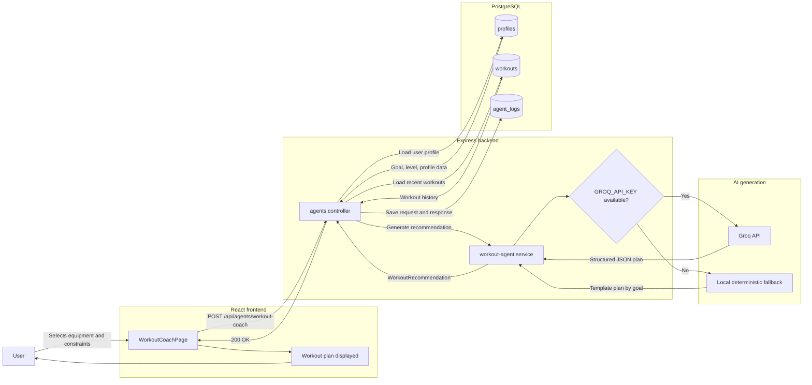
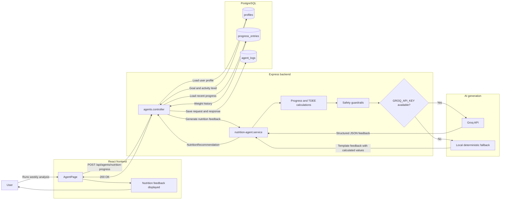
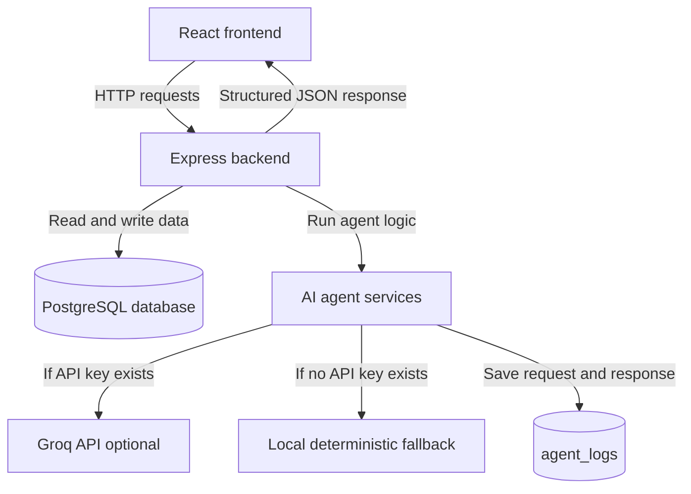

# AI Agent Workflow

This document describes the workflow of the two SmartCoach AI agents.

SmartCoach includes two product agents:

* **Workout Coach Agent** — generates workout recommendations.
* **Nutrition / Progress Agent** — analyzes progress and gives nutrition-oriented feedback.

Both agents support two execution modes:

* **Groq mode** — used when `GROQ_API_KEY` is available.
* **Local fallback mode** — deterministic response used when no API key is available.

---

## Agent 1 — Workout Coach Agent



### Workout Coach summary

The Workout Coach Agent creates a structured workout plan using the user's profile, recent workout history, selected equipment and constraints.

The backend endpoint is:

```text
POST /api/agents/workout-coach
```

### Main input data

| Input                  | Source        |
| ---------------------- | ------------- |
| User goal              | `profiles`    |
| Activity level         | `profiles`    |
| Available equipment    | frontend form |
| Training constraints   | frontend form |
| Recent workout history | `workouts`    |

### Main output data

The agent returns a structured recommendation with:

* warmup
* main workout
* cooldown
* weekly plan
* practical tips
* generated timestamp

### Execution modes

| Mode                | Description                                        |
| ------------------- | -------------------------------------------------- |
| Groq API mode       | Used when `GROQ_API_KEY` exists                    |
| Local fallback mode | Used when no API key exists                        |
| Logging             | Each request and response is saved in `agent_logs` |

---

## Agent 2 — Nutrition / Progress Agent



### Nutrition / Progress summary

The Nutrition / Progress Agent analyzes recent weight evolution and generates safe progress feedback.

The backend endpoint is:

```text
POST /api/agents/nutrition-progress
```

### Main input data

| Input          | Source                |
| -------------- | --------------------- |
| User goal      | `profiles`            |
| Activity level | `profiles`            |
| Weight history | `progress_entries`    |
| Recent trend   | calculated in service |
| TDEE estimate  | calculated in service |

### Main output data

The agent returns structured feedback with:

* progress feedback
* calorie guidance
* protein recommendation
* hydration recommendation
* habit suggestions
* safety notes
* generated timestamp

### Guardrails

| Guardrail          | Rule                                     |
| ------------------ | ---------------------------------------- |
| Minimum calories   | At least 1200 kcal per day               |
| Maximum adjustment | Maximum 300 kcal adjustment              |
| Medical safety     | No diagnosis or medical treatment advice |
| Demo safety        | Works even without external API key      |

---

## Shared design



---

## Guardrails summary

| Feature                    | Workout Coach Agent              | Nutrition / Progress Agent          |
| -------------------------- | -------------------------------- | ----------------------------------- |
| Uses backend service       | Yes                              | Yes                                 |
| Uses PostgreSQL data       | Yes                              | Yes                                 |
| Optional Groq integration  | Yes                              | Yes                                 |
| Works without API key      | Yes                              | Yes                                 |
| Deterministic fallback     | Yes                              | Yes                                 |
| Structured JSON output     | Yes                              | Yes                                 |
| Saves request and response | `agent_logs`                     | `agent_logs`                        |
| No medical diagnosis       | Yes                              | Yes                                 |
| No dangerous advice        | Yes                              | Yes                                 |
| Uses profile data          | Yes                              | Yes                                 |
| Uses history data          | Recent workouts                  | Progress entries                    |
| Specific safety rule       | Volume adapted by activity level | Minimum calories and adjustment cap |

---

## Why the workflow is demo-safe

The agents are implemented as backend services, not as simple frontend text blocks. This makes the system easier to test, evaluate and extend.

During the MDS demo, the agents can run in two ways:

1. With a real LLM provider, using `GROQ_API_KEY`.
2. Without external services, using deterministic fallback logic.

This means the application remains functional even if the external API is unavailable during the presentation.
