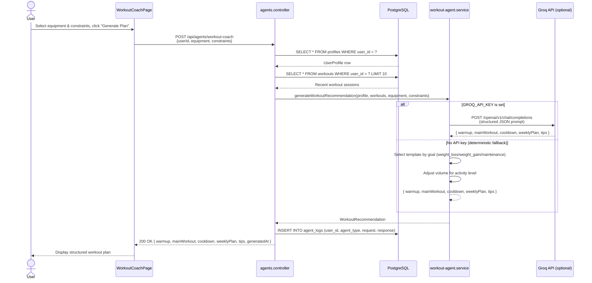
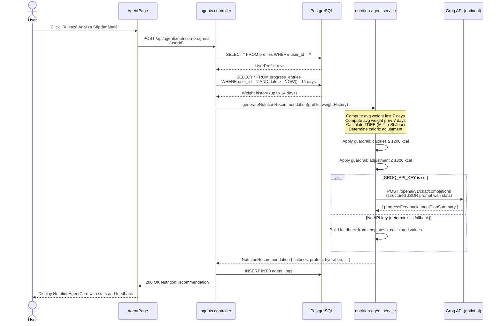

# AI Agent Workflow

## Agent 1 — Workout Coach Agent

## Agent 2 — Nutrition / Progress Agent

## Guardrails Summary

| Guardrail | Agent 1 | Agent 2 |
|---|---|---|
| Min caloric recommendation | N/A | ≥ 1200 kcal |
| Max caloric adjustment | N/A | ±300 kcal/week |
| Volume adaptation | Activity level reduces sets | N/A |
| No medical claims | ✅ | ✅ |
| No dangerous terminology | ✅ | ✅ |
| Structured output | ✅ JSON | ✅ JSON |
| Always works without API key | ✅ Deterministic fallback | ✅ Deterministic fallback |
| Agent request logged to DB | ✅ `agent_logs` | ✅ `agent_logs` |
